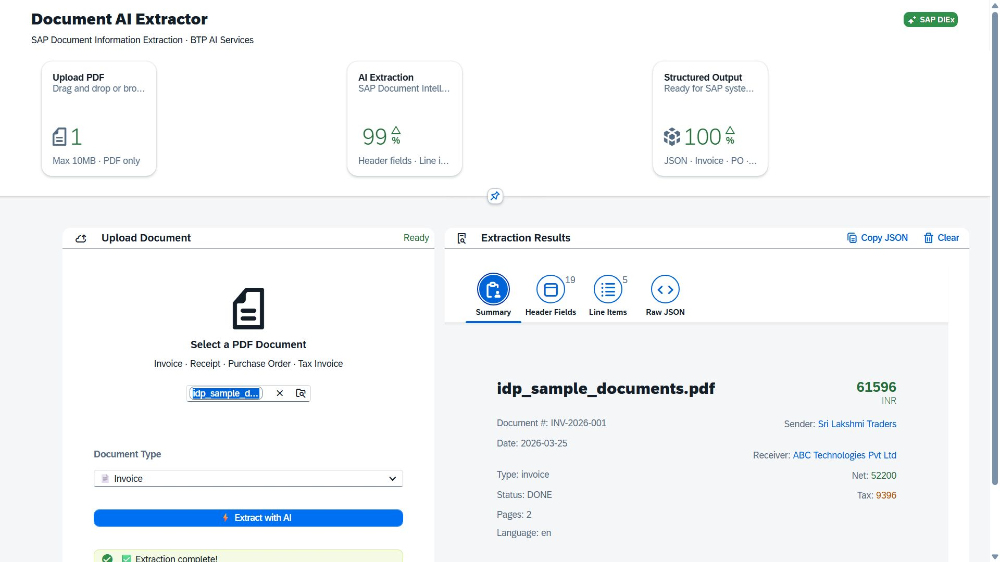
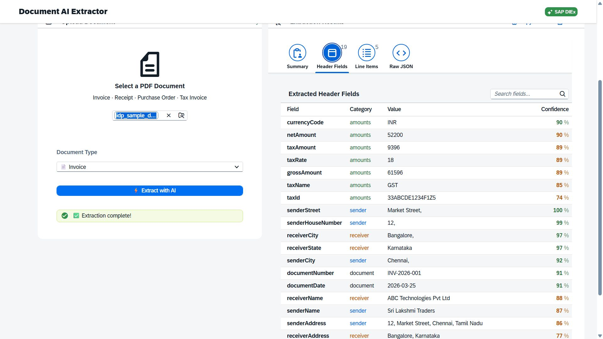
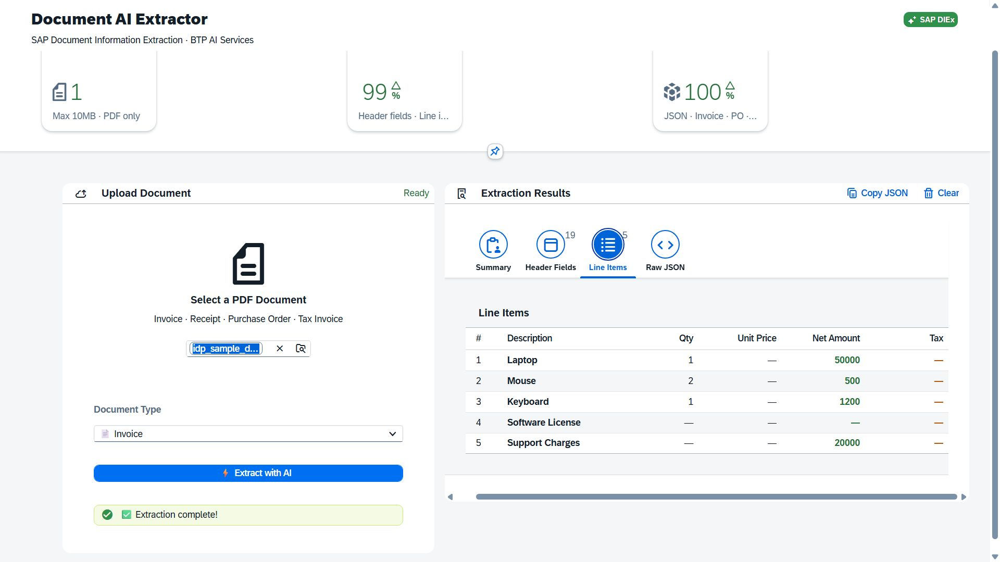
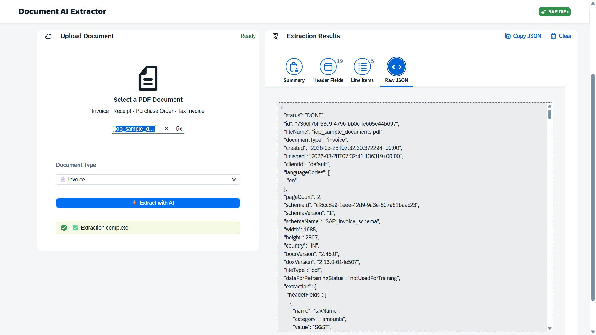

# BTP-AI-Document-Processor

An intelligent document processing application built on **SAP Business Technology Platform (BTP)** using the **SAP Cloud Application Programming Model (CAP)** and **SAPUI5**. The application integrates with **SAP Document Information Extraction (DIEx)** to automatically parse PDF business documents and surface structured, business-ready data — replacing manual document entry with AI-powered extraction.

---

## Application Screenshots

### Extraction Summary


### Header Fields Extraction


### Line Items Extraction


### Raw JSON Output


---

## What Gets Extracted

Upload a PDF invoice, purchase order, receipt, or tax document and the application returns:

### Header Fields (19 fields)

| Category | Fields Extracted |
|---|---|
| Financial | currencyCode, netAmount, taxAmount, taxRate, grossAmount, taxName, taxId |
| Sender | senderName, senderStreet, senderHouseNumber, senderCity, senderAddress |
| Receiver | receiverName, receiverCity, receiverState, receiverAddress |
| Document | documentNumber, documentDate |

Each field is returned with a **confidence score** (0–100%). Low-confidence fields are highlighted for manual review. Duplicate values are automatically removed and results are sorted by confidence.

### Line Items

Tabular line data is extracted and displayed per row:

| Column | Example |
|---|---|
| Description | Laptop, Mouse, Keyboard, Software License, Support Charges |
| Quantity | 1, 2, 1 |
| Unit Price | — (if unavailable) |
| Net Amount | 50000, 500, 1200, 20000 |
| Tax | Per line where available |

### Raw JSON

The full DIEx API response is exposed in a scrollable viewer with a one-click Copy JSON action — useful for downstream integration or debugging.

---

## Architecture

```
PDF Upload (SAPUI5)
        |
        v
CAP Node.js Backend
  - File upload (Multer)
  - OAuth2 token fetch (XSUAA/UAA)
  - DIEx API call
        |
        v
SAP Document Information Extraction (DIEx)
        |
        v  [Async polling until status: DONE]
Structured Extraction Response
        |
        v
OData V4 Service  ──►  Extraction History & Audit Log
        |
        v
SAPUI5 Results View
  - Summary tab
  - Header Fields tab (19 fields)
  - Line Items tab
  - Raw JSON tab
```

---

## Features

- **Async processing with polling** — submission and result fetch are decoupled; the UI polls until the job status returns `DONE`
- **Confidence-aware display** — per-field confidence scores shown; low-confidence fields flagged for review
- **Extraction history** — every processed document is logged via OData V4 with metadata, timestamps, status, and AI response payload
- **Multi-document type support** — Invoice, Receipt, Purchase Order, Tax Invoice
- **Copy JSON** — raw DIEx response available for clipboard copy
- **Search and filter** — real-time field lookup across extraction results

---

## Technology Stack

| Layer | Technology |
|---|---|
| Frontend | SAPUI5, SAP Fiori (XML Views, MVC, JSONModel, Horizon Theme) |
| Backend | SAP CAP Node.js, Express.js, Axios, Multer |
| AI Service | SAP Document Information Extraction (DIEx) |
| Authentication | OAuth2 (Client Credentials via XSUAA/UAA) |
| Database | SQLite (local), SAP HANA Cloud (production) |
| Platform | SAP Business Technology Platform (BTP) |
| Deployment | Cloud Foundry, MTA |

---

## Project Structure

```
.
├── app/                        # SAPUI5 frontend
├── db/
│   └── docai-schema.cds        # CDS data model
├── srv/                        # CAP service handlers
├── images/                     # Application screenshots
├── mta.yaml                    # MTA deployment descriptor
├── xs-security.json            # XSUAA configuration
├── env.example.json            # Environment variable template
└── .env1                       # Local environment config
```

---

## Getting Started

### Prerequisites

- Node.js
- SAP CAP CLI (`npm install -g @sap/cds-dk`)
- SAP BTP Account with Document Information Extraction service instance

### Setup

```bash
git clone <repository-url>
cd BTP-AI-Document-Processor
npm install
cp env.example.json default-env.json
```

Update `default-env.json` with your SAP BTP DIEx service credentials, then:

```bash
cds watch
```

Open at `http://localhost:4004`

---

## Key Concepts Explored

- **SAP DIEx Integration** — Connecting to SAP Document Information Extraction via REST API with OAuth2 client credentials flow
- **Asynchronous Processing** — Polling mechanism to track extraction job status before fetching results
- **Confidence Score Handling** — Filtering, deduplicating, and sorting AI-extracted fields by confidence
- **CAP OData V4** — Persisting and exposing extraction history as an auditable OData service
- **Custom SAPUI5 UI** — Split-panel upload and results viewer with tabbed output (Summary / Header Fields / Line Items / Raw JSON)

---

## Roadmap

- [x] PDF upload and DIEx extraction
- [x] Header fields extraction (19 fields) with confidence scores
- [x] Line item extraction
- [x] Raw JSON viewer with copy action
- [x] Extraction history via OData V4
- [ ] OCR support for scanned documents
- [ ] SAP S/4HANA integration for extracted invoice posting
- [ ] SAP Build Process Automation for approval workflows
- [ ] Multi-language document support
- [ ] Export to Excel / PDF

---

## Learning Outcomes

This project provided hands-on experience integrating SAP BTP AI services into a full-stack CAP application — covering OAuth2 authentication, asynchronous API patterns, confidence-aware data handling, and OData-backed audit logging — demonstrating how enterprise document automation can be built end-to-end on the SAP BTP ecosystem.
